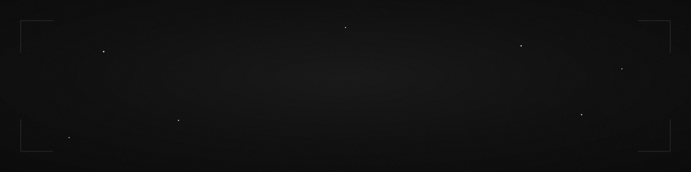

<div align="center">

<!-- ═══════════════════════ HEADER ═══════════════════════ -->

<a href="https://lydiaix.fr">
  
</a>

<!-- ═══════════════════════ TYPING ═══════════════════════ -->

<a href="https://lydiaix.fr">
  
</a>

<br/>

<!-- ═══════════════════════ BADGES ═══════════════════════ -->

<a href="https://lydiaix.fr">
  
</a>
<a href="https://github.com/Lydiaix">
  
</a>
<a href="https://x.com/lydiaix_">
  
</a>
<a href="https://tiktok.com/@lydiaix_">
  
</a>


<br/><br/>


</div>

<!-- ═══════════════════════ À PROPOS ═══════════════════════ -->

## À propos

**Lydiaix**, développeur full-stack. Je pratique le **développement assisté par l'IA** en production : l'IA (**Claude Code**) pour la vélocité, l'humain pour l'architecture, la revue et la sécurité. Le résultat : des produits livrés vite, sans dette cachée.

**TypeScript de bout en bout** — React côté client, Node.js côté serveur — et **C# / .NET** pour les applications métier et les API robustes, avec une attention particulière portée à ce que la plupart des développeurs remettent à plus tard : la sécurité. Chaque projet que je livre est audité contre l'**OWASP Top 10**.

Je conçois tout type de logiciel — du SaaS à l'API — avec une exigence simple : **concevoir vite, sécuriser correctement, livrer solide.**

<table>
  <tr>
    <td><b>Localisation</b></td>
    <td>France 🇫🇷</td>
    <td><b>Langue de travail</b></td>
    <td>FR / EN</td>
  </tr>
  <tr>
    <td><b>Statut</b></td>
    <td>Disponible</td>
    <td><b>Réponse</b></td>
    <td>Sous 24 h</td>
  </tr>
</table>

<div align="center">

</div>

<!-- ═══════════════════════ SERVICES ═══════════════════════ -->

## Services

> Du développement d'un produit complet au durcissement d'une application existante, chaque mission suit la même exigence de qualité.

<table>
  <tr>
    <th width="33%">Développement sur mesure</th>
    <th width="33%">Audit de sécurité</th>
    <th width="33%">Hardening</th>
  </tr>
  <tr>
    <td>Applications web, SaaS, API, outils internes… Je conçois et développe tout type de logiciel, de l'idée à la mise en production, avec une stack moderne et éprouvée.</td>
    <td>Analyse complète de votre code, de vos dépendances et de votre surface d'attaque. Identification des vecteurs OWASP Top 10 avec un rapport clair et priorisé.</td>
    <td>Renforcement de chaque couche : authentification robuste, validation des entrées, gestion des secrets, en-têtes HTTP durcis. Votre application tient la charge et l'attaque.</td>
  </tr>
</table>

<div align="center">

</div>

<!-- ═══════════════════════ STACK ═══════════════════════ -->

## Stack

> Une stack resserrée et moderne, choisie pour la vélocité et la fiabilité en production.

<div align="center">

### Langages

<table>
  <tr>
    <td align="center" width="110">
      
      <br/><sub><b>TypeScript</b></sub>
    </td>
    <td align="center" width="110">
      
      <br/><sub><b>JavaScript</b></sub>
    </td>
    <td align="center" width="110">
      
      <br/><sub><b>C# / .NET</b></sub>
    </td>
    <td align="center" width="110">
      
      <br/><sub><b>HTML5</b></sub>
    </td>
    <td align="center" width="110">
      
      <br/><sub><b>CSS3</b></sub>
    </td>
  </tr>
</table>

### Frontend

<table>
  <tr>
    <td align="center" width="110">
      
      <br/><sub><b>React</b></sub>
    </td>
    <td align="center" width="110">
      
      <br/><sub><b>Next.js</b></sub>
    </td>
    <td align="center" width="110">
      
      <br/><sub><b>Tailwind CSS</b></sub>
    </td>
    <td align="center" width="110">
      
      <br/><sub><b>Vite</b></sub>
    </td>
  </tr>
</table>

### Backend & BDD

<table>
  <tr>
    <td align="center" width="110">
      
      <br/><sub><b>Node.js</b></sub>
    </td>
    <td align="center" width="110">
      
      <br/><sub><b>Express</b></sub>
    </td>
    <td align="center" width="110">
      
      <br/><sub><b>ASP.NET Core</b></sub>
    </td>
    <td align="center" width="110">
      
      <br/><sub><b>PostgreSQL</b></sub>
    </td>
    <td align="center" width="110">
      
      <br/><sub><b>MongoDB</b></sub>
    </td>
  </tr>
</table>

<sub>Entity Framework · LINQ · REST API</sub>

### Sécurité & DevOps

<table>
  <tr>
    <td align="center" width="110">
      
      <br/><sub><b>OWASP Top 10</b></sub>
    </td>
    <td align="center" width="110">
      
      <br/><sub><b>JWT</b></sub>
    </td>
    <td align="center" width="110">
      
      <br/><sub><b>Docker</b></sub>
    </td>
    <td align="center" width="110">
      
      <br/><sub><b>Git</b></sub>
    </td>
    <td align="center" width="110">
      
      <br/><sub><b>CI/CD</b></sub>
    </td>
  </tr>
</table>

### IA & Workflow

<table>
  <tr>
    <td align="center" width="110">
      
      <br/><sub><b>Claude</b></sub>
    </td>
    <td align="center" width="110">
      
      <br/><sub><b>Claude Code</b></sub>
    </td>
  </tr>
</table>


</div>

<!-- ═══════════════════════ MÉTHODE ═══════════════════════ -->

## Méthode

> Une méthode éprouvée en quatre temps, appliquée à chaque audit comme à chaque ligne de code que je livre.

| | Étape | Ce que je fais |
|:-:|-------|----------------|
| **01** | **Audit** | Analyse complète du code, des dépendances et de la surface d'attaque. Rien n'est laissé au hasard : chaque point d'entrée est cartographié. |
| **02** | **Threat modeling** | Identification des vecteurs d'attaque selon l'OWASP Top 10 : injections, authentification cassée, exposition de données, mauvaises configurations… |
| **03** | **Durcissement** | Implémentation robuste sur toutes les couches applicatives : authentification, validation des entrées, gestion des secrets, en-têtes HTTP. |
| **04** | **Solutions** | Pas de recommandations vagues : des correctifs concrets, testés et documentés, prêts à être déployés. Vous repartez avec du code qui tourne, pas un PDF. |

```
$ lydiaix audit ./votre-projet

  ✔ Analyse du code et des dépendances
  ✔ Authentification & validation des entrées
  ✔ En-têtes HTTP durcis, secrets hors du code
  ✔ OWASP Top 10 — 0 vulnérabilité critique

  Livraison : testée, documentée, solide.
```

<div align="center">

</div>

<!-- ═══════════════════════ RÉALISATIONS ═══════════════════════ -->

## Réalisations

> Des projets bien réels, en ligne et jouables. Le meilleur argument reste toujours le lien qui fonctionne.

<table>
  <tr>
    <td width="70%">
      <h3><a href="https://candy-bonboria.fr">Candy Bonboria</a></h3>
      <p>Un jeu navigateur sucré, jouable directement en ligne : conception, développement et mise en production de bout en bout, du gameplay à l'hébergement.</p>
      <sub>Jeu en ligne · TypeScript · React · Node.js</sub>
    </td>
    <td width="30%" align="center">
      <a href="https://candy-bonboria.fr">
        
      </a>
    </td>
  </tr>
</table>

<div align="center">

</div>

<!-- ═══════════════════════ STATS ═══════════════════════ -->

## Activité GitHub

<div align="center">


<br/>


<br/><br/>

<!-- 🐍 Nécessite d'avoir lancé la GitHub Action `snake.yml` une fois (crée la branche `output`) -->


</div>

<!-- ═══════════════════════ CONTACT ═══════════════════════ -->

## Discutons de votre projet

Un produit à construire, une application à auditer ou à durcir ? Décrivez votre besoin, je reviens vers vous **sous 24 h**.

Le premier échange sert à cadrer : périmètre, contraintes, budget. Vous savez exactement où vous allez avant que la première ligne de code soit écrite.

<div align="center">

<br/>

<a href="https://lydiaix.fr">
  
</a>
&nbsp;
<a href="https://x.com/lydiaix_">
  
</a>
&nbsp;
<a href="https://tiktok.com/@lydiaix_">
  
</a>

<br/><br/>

<a href="https://lydiaix.fr">
  
</a>

<sub>Conçu et développé en TypeScript — sécurisé par design.</sub>

</div>
